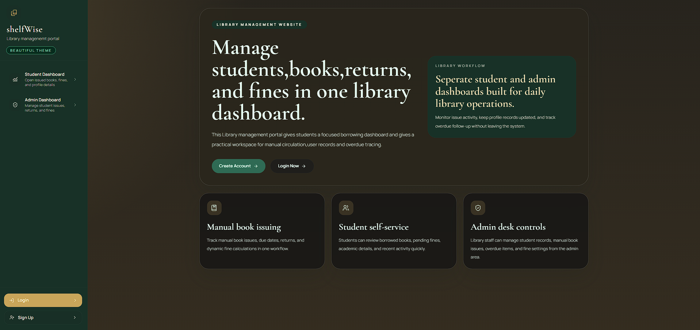
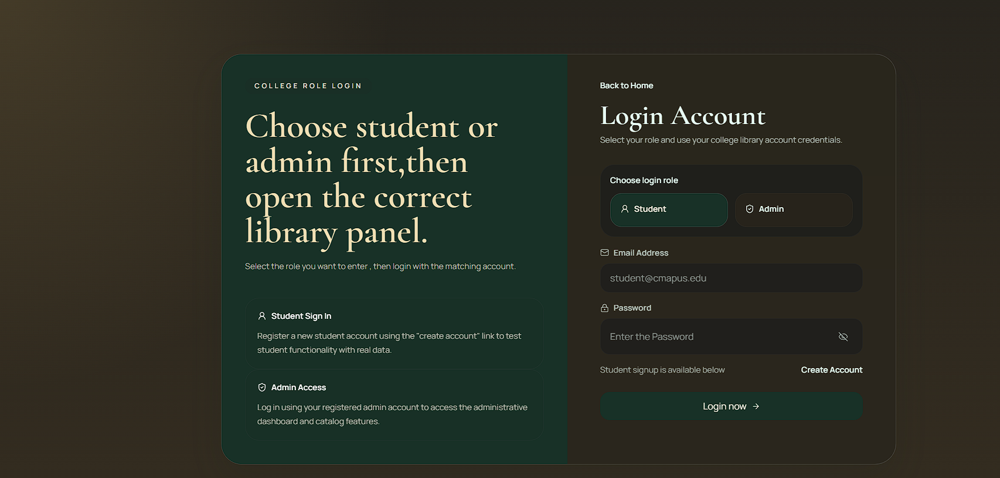
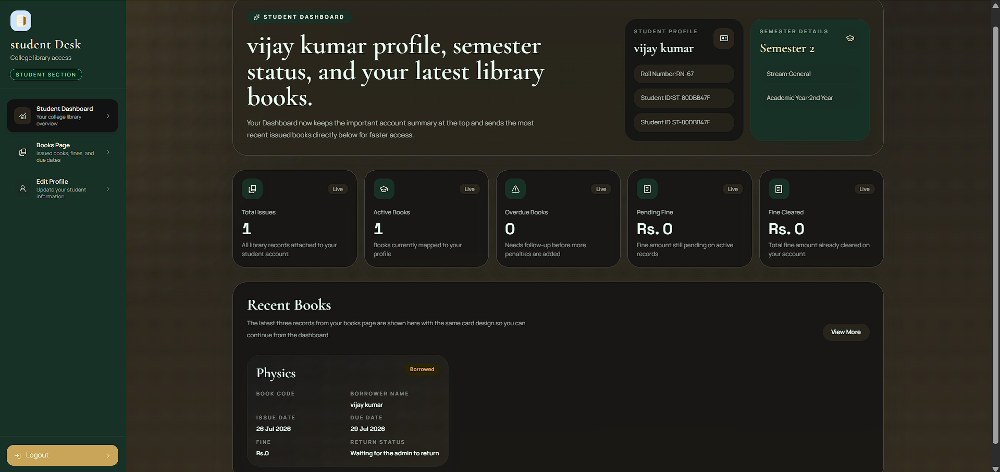
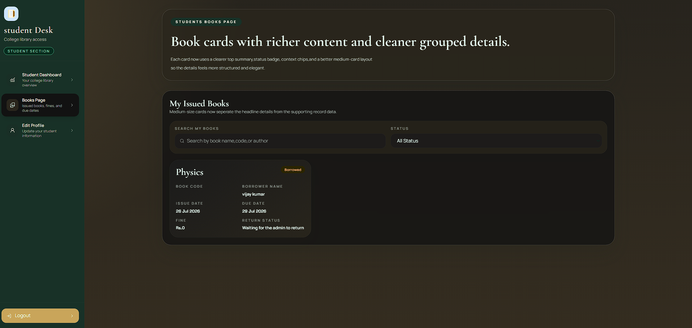
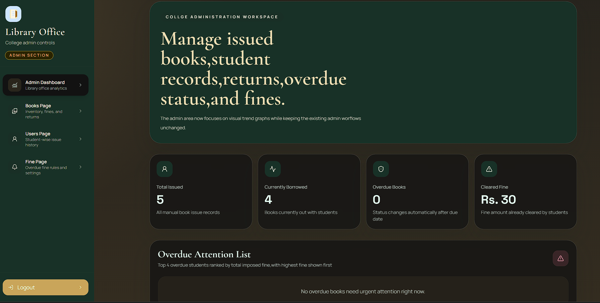
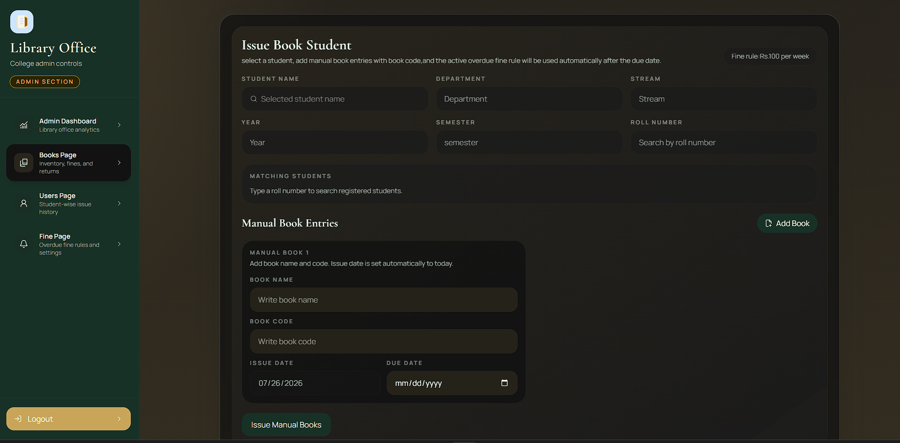

<div align="center">


<p>
  
  
  
  
  
  
  
</p>

<p>
A role-based library management system with separate <b>Admin</b> and <b>Student</b> workspaces — manual book issuing, live overdue tracking, dynamic fine calculation, and CSV exports, built on a React + Node/Express + MongoDB stack.
</p>

</div>

<br/>

## 📖 Table of Contents

- [Overview](#-overview)
- [Features](#-features)
- [Tech Stack](#-tech-stack)
- [Project Architecture](#-project-architecture)
- [Screenshots](#-screenshots)
- [Getting Started](#-getting-started)
- [Environment Variables](#-environment-variables)
- [API Overview](#-api-overview)
- [Roadmap](#-roadmap)
- [Contributing](#-contributing)
- [License](#-license)

<br/>

## 🔎 Overview

**ShelfWise** is a full-stack college library management portal built around two focused dashboards:

- An **Admin workspace** for issuing books manually, tracking every student's borrowing status, applying and clearing fines, and monitoring overdue accounts in real time.
- A **Student workspace** where students can view their profile, issued books, live fine totals, and due dates without needing to contact the library desk.

The system automatically computes overdue status and fines based on due dates and a configurable fine rule (amount + interval), so admins only manage exceptions rather than manual calculations.

<br/>

## ✨ Features

### 🛡️ Admin

- 📊 **Live analytics dashboard** — total issued, currently borrowed, overdue books, and cleared fines at a glance
- 📚 **Manual book issuing** — search students by roll number, issue multiple books in one form, auto-filled issue dates
- 👥 **Student directory** — every registered student with borrowing status (`Clear` / `Borrowing` / `Overdue`), searchable and filterable
- 💰 **Fine management** — clear fines, apply manual adjustments, and configure the global fine rule (amount per day/week/month/year)
- ↩️ **Returns handling** — mark books as returned, with automatic status and fine recalculation
- 📤 **CSV export** — export the currently filtered student/book list for record-keeping
- 🔔 **Overdue attention list** — top overdue students ranked by outstanding fine, surfaced directly on the dashboard

### 🎓 Student

- 🪪 **Personal dashboard** — profile summary, roll number, semester, and stream at a glance
- 📘 **Issued books view** — active and historical borrowing records with due dates and live status
- 💵 **Fine visibility** — see pending and cleared fine amounts per book
- ✏️ **Profile management** — update personal and academic details
- 🔐 **Secure onboarding** — email + OTP verification during signup before profile completion

### 🔐 Platform-wide

- Role-based route protection (Admin vs. Student) with JWT authentication
- Responsive layout with a collapsible sidebar for mobile and desktop
- Automatic overdue/fine status recalculation — no manual "mark as overdue" step required

<br/>

## 🛠️ Tech Stack

<table>
<tr>
<td valign="top" width="50%">

**Frontend**

| Technology | Purpose |
|---|---|
| React (Vite) | UI library & build tooling |
| React Router v7 | Client-side routing & protected routes |
| Tailwind CSS v4 | Utility-first styling |
| Lucide React | Icon set |
| Context API | Global auth & library state |

</td>
<td valign="top" width="50%">

**Backend**

| Technology | Purpose |
|---|---|
| Node.js + Express | REST API server |
| MongoDB + Mongoose | Database & ODM |
| JSON Web Tokens (JWT) | Authentication |
| bcrypt.js | Password hashing |
| OTP + Email delivery | Signup verification |

</td>
</tr>
</table>

<br/>

## 🏗️ Project Architecture

```
Library/
├── frontend/                  # React + Vite client
│   └── src/
│       ├── admin/             # Admin dashboard, books, users, fines pages
│       ├── user/              # Student dashboard, books, profile pages
│       ├── shared/            # AuthContext, LibraryContext, ProtectedRoute
│       ├── components/        # Reusable UI (Sidebar, etc.)
│       └── assets/            # Centralized style definitions
│
└── backend/                   # Node + Express API
    ├── controllers/           # Auth, book, and student business logic
    ├── models/                # Mongoose schemas (User, Issue, FineSetting)
    ├── routes/                # Express route definitions
    ├── middleware/             # JWT auth & role-based access control
    └── utils/                 # OTP email delivery
```

<br/>

## 📸 Screenshots

### 🏠 Landing Page

<p align="center">
  
</p>

---

### 🔐 Login Page

<p align="center">
  
</p>

---

### 🎓 Student Dashboard

<p align="center">
  
</p>

---

### 📚 Student Books & Profile

<p align="center">
  
</p>

---

### 🛡️ Admin Dashboard

<p align="center">
  
</p>

---

### 📖 Manual Book Issuing

<p align="center">
  
</p>

## 🚀 Getting Started

### Prerequisites

- [Node.js](https://nodejs.org/) (v18+ recommended)
- A running [MongoDB](https://www.mongodb.com/) instance (local or Atlas)

### 1. Clone the repository

```bash
git clone https://github.com/sai-vignesh-ops/your-repo-name.git
cd your-repo-name
```

### 2. Set up the backend

```bash
cd backend
npm install
```

Create a `.env` file inside `backend/` (see [Environment Variables](#-environment-variables) below), then start the server:

```bash
npm start
```

The API will run at `http://localhost:5000`.

### 3. Set up the frontend

```bash
cd ../frontend
npm install
npm run dev
```

The app will run at `http://localhost:5173` (default Vite port).

<br/>

## 🔑 Environment Variables

Create a `.env` file inside the `backend/` folder with the following keys:

| Variable | Description |
|---|---|
| `MONGODB_URI` | MongoDB connection string |
| `JWT_SECRET` | Secret key used to sign authentication tokens *(use a long, random value — never a placeholder string)* |
| `PORT` | Port for the Express server *(defaults to `5000`)* |
| Email/SMTP credentials | Used by `utils/sendOTP.js` to deliver signup OTP emails |

> ⚠️ Never commit your `.env` file. Confirm it's listed in `.gitignore` before pushing.

<br/>

## 📡 API Overview

| Method | Endpoint | Description | Access |
|---|---|---|---|
| `POST` | `/api/auth/register` | Register a student, sends OTP | Public |
| `POST` | `/api/auth/verify-otp` | Verify signup OTP | Public |
| `POST` | `/api/auth/login` | Login (student or admin) | Public |
| `GET` | `/api/auth/users` | List all registered students | Admin |
| `GET` | `/api/students/search-by-roll` | Search students by roll number | Admin |
| `POST` | `/api/books/issue-manual` | Issue one or more books to a student | Admin |
| `GET` | `/api/books/issues` | List all issued books | Admin |
| `GET` | `/api/books/issue/student` | List the logged-in student's issued books | Student |
| `PUT` | `/api/books/issues/:id/return` | Mark a book as returned | Admin |
| `PUT` | `/api/books/issues/:id/clear-fine` | Clear a fine on a record | Admin |
| `GET` / `PUT` | `/api/books/fine-settings` | View or update the global fine rule | Admin |

<br/>

## 🗺️ Roadmap

- [ ] Email notifications for upcoming due dates
- [ ] Bulk book import via CSV
- [ ] Book catalog search & availability tracking
- [ ] Dark/light theme toggle

<br/>

## 🤝 Contributing

Contributions, issues, and feature requests are welcome.

1. Fork the project
2. Create your feature branch (`git checkout -b feature/amazing-feature`)
3. Commit your changes (`git commit -m 'Add some amazing feature'`)
4. Push to the branch (`git push origin feature/amazing-feature`)
5. Open a Pull Request

<br/>

## 📄 License

Distributed under the **MIT License**. See `LICENSE` for more information.

<br/>

<div align="center">


Made with 📚 for smarter library management

</div>